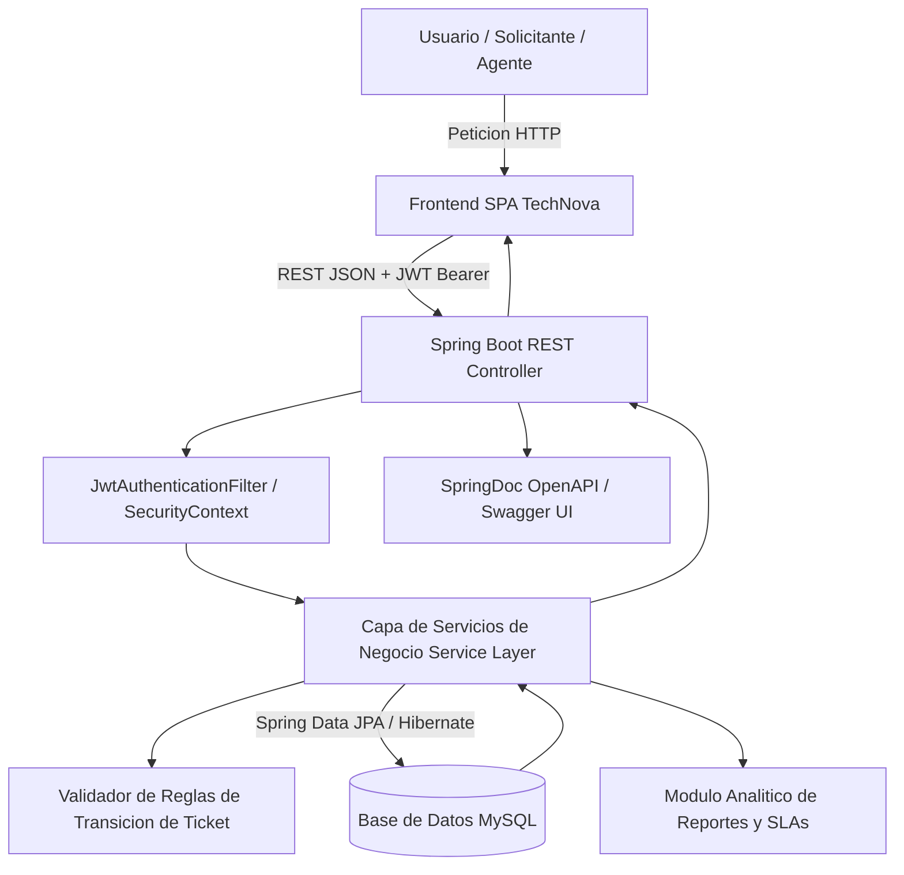

# TechNova - Sistema Integral de Mesa de Ayuda y Gestion de Tickets Empresariales

Plataforma corporativa de nivel empresarial para la recepcion, clasificacion, resolucion y auditoria de tickets de soporte tecnico y servicios de tecnologia.

[]()
[]()
[]()
[]()
[]()

## Resumen Ejecutivo

En entornos corporativos medianos y grandes, la falta de trazabilidad en solicitudes de soporte ocasiona incumplimientos de acuerdos de nivel de servicio (SLA), duplicidad de esfuerzos y perdida de visibilidad sobre problemas recurrentes en infraestructura. TechNova proporciona una solucion centralizada y escalable construida sobre Spring Boot 4 y MySQL, permitiendo a las organizaciones canalizar solicitudes, asignar prioridades dinamicas y emitir reportes de desempeno de equipos de soporte.

## Alcance y Objetivos de Negocio

- Registro y ciclo de vida de tickets de soporte (Abierto, Asignado, En Analisis, En Espera de Proveedor, Resuelto, Cerrado).
- Gestion de acuerdos de nivel de servicio (SLA) categorizados por impacto y urgencia.
- Seguridad perimetral robusta con autenticacion JWT y control de acceso basado en roles (Admin, Agente Tecnico, Empleado Solicitante).
- Generacion de metricas operativas, tiempos de primera respuesta y resolucion en modulo de reportes analiticos.
- Documentacion y pruebas estandarizadas de endpoints mediante archivos `.http` y Swagger UI.

## Arquitectura del Sistema

TechNova esta disenado bajo los principios de la Arquitectura Limpia y el patron por Capas de Spring Boot:
1. Capa de Controladores REST (`project/src/.../controller`):
   Expone contratos HTTP, valida datos de entrada con Bean Validation (`@Valid`) y gestiona codigos de estado.
2. Capa de Seguridad y Filtros (`security/`):
   Intercepta cabeceras `Authorization: Bearer <token>`, valida firmas JWT y establece el contexto de seguridad.
3. Capa de Servicios de Negocio (`service/`):
   Implementa la logica transaccional (`@Transactional`), control de SLAs y reglas de transicion de estados.
4. Capa de Repositorios y Persistencia (`repository/`):
   Abstraccion JPA / Hibernate conectada a motor relacional MySQL.
5. Capa Frontend Desacoplada (`frontend/`):
   Interfaz moderna SPA en JavaScript, HTML5 y CSS estructurado por componentes.

### Diagrama de Flujo Arquitectonico


```mermaid
flowchart TD
    A[Usuario / Solicitante / Agente] -->|Peticion HTTP| B[Frontend SPA TechNova]
    B -->|REST JSON + JWT Bearer| C[Spring Boot REST Controller]
    C --> D[JwtAuthenticationFilter / SecurityContext]
    D --> E[Capa de Servicios de Negocio Service Layer]
    E --> F[Validador de Reglas de Transicion de Ticket]
    E -->|Spring Data JPA / Hibernate| G[(Base de Datos MySQL)]
    E --> H[Modulo Analitico de Reportes y SLAs]
    C --> I[SpringDoc OpenAPI / Swagger UI]
    G --> E
    E --> C
    C --> B
```

### Estructura de Directorios

```text
TechNova/
├── .env.example             # Ejemplo de configuracion de base de datos y llaves JWT
├── .gitignore               # Reglas de exclusion de artefactos de compilacion
├── auth-tests.http          # Suite de pruebas HTTP para VS Code REST Client
├── ERS TechNova.md          # Especificacion de Requerimientos de Software formal
├── README.md                # Documentacion tecnica de ingenieria del proyecto
├── frontend/                # Aplicacion de interfaz de usuario desacoplada
│   ├── index.html           # Vista principal y acceso a la plataforma
│   ├── dashboard.html       # Centro de control con metricas e indicadores globales
│   ├── tickets.html         # Bandeja de entrada y gestion tabular de solicitudes
│   ├── ticket-detail.html   # Vista individual de conversacion, adjuntos y cambios de estado
│   ├── reportes.html        # Tableros estadisticos y metricas operativas
│   ├── tests.html           # Interfaz para ejecucion de validaciones en navegador
│   ├── css/                 # Estilos estructurados (base, componentes, layout, paginas)
│   └── js/                  # Modulos JavaScript del cliente (api.js, app.js)
└── project/                 # Modulo Backend Spring Boot en Java
    ├── build.gradle         # Manifiesto de dependencias Gradle y plugins
    ├── gradlew / gradlew.bat# Wrappers de construccion Gradle
    └── src/main/java/...    # Controladores, servicios, modelos y seguridad
```

## Stack Tecnologico

Ecosistema de tecnologias enterprise con soporte a largo plazo (LTS) y maximas garantias de seguridad.

### Backend y Persistencia Relacional

-  Entorno tipado seguro con caracteristicas modernas del lenguaje.
-  Framework lider en desarrollo de servicios micro y macroempresariales.
-  Control perimetral de sesiones y autorizacion granular por metodo.
-  Manejo sin estado de autorizaciones mediante JJWT 0.12.6.
-  Construccion declarativa y optimizacion de paquetes jar.
-  Motor relacional transaccional cumpliendo estandares ACID.
-  Documentacion interactiva de contratos REST.

### Frontend y Experiencia de Usuario

-  Cliente REST asincrono estructurado.
-  Plantillas semanticas con diseno centrado en productividad.
-  Estilos arquitecturados en capas (Base, Componentes, Layout y Paginas).

### Herramientas de Desarrollo y Calidad

- **Project Lombok**: Reduccion de codigo repetitivo (boilerplate) mediante anotaciones Java (`@Data`, `@Builder`, `@RequiredArgsConstructor`).
- **REST Client (`auth-tests.http`)**: Coleccion interactiva de pruebas de integracion listas para ejecutarse sin requerir herramientas pesadas como Postman.

## Requisitos Previos del Sistema

- Java JDK: Version 21 instalada y activa en variables de entorno.
- Base de Datos: Servidor MySQL 8.0 o superior (puerto local 3306).
- Memoria RAM: Minimo 4 GB disponibles para la JVM y el demonio de base de datos.
- Navegador web moderno con soporte para CSS Grid y Fetch API.

### Variables de Entorno y Parametros de Conexion

Configurar el archivo `.env` o las propiedades de aplicacion en `application.properties`:

| Variable | Descripcion | Valor Predeterminado |
| :--- | :--- | :--- |
| `SERVER_PORT` | Puerto de escucha HTTP del backend | `8080` |
| `SPRING_DATASOURCE_URL` | Cadena JDBC de conexion | `jdbc:mysql://localhost:3306/technova_db?useSSL=false&serverTimezone=UTC` |
| `SPRING_DATASOURCE_USERNAME` | Usuario de base de datos | `root` |
| `SPRING_DATASOURCE_PASSWORD` | Contrasena de acceso a MySQL | `rootpassword` |
| `JWT_SECRET` | Clave criptografica HMAC-SHA256 | Cadena Base64 de minimo 256 bits |
| `JWT_EXPIRATION_MS` | Validez del token en milisegundos | `86400000` (24 horas) |
